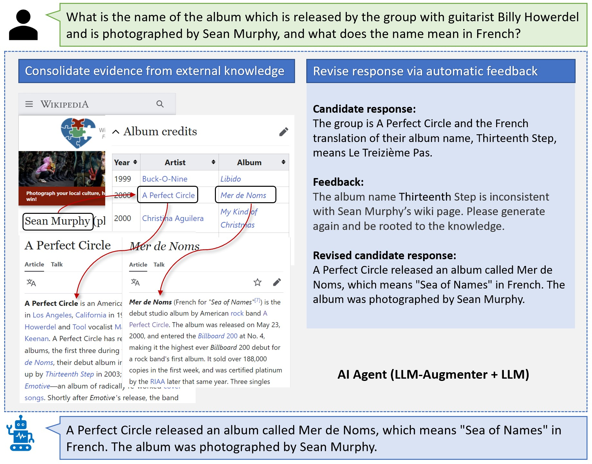

# LLM-Augmenter

This repository will provide soon an implementation of LLM-Augmenter, which is described in this paper:

[Check Your Facts and Try Again: Improving Large Language Models with External Knowledge and Automated Feedback](https://arxiv.org/abs/2302.12813)\
*Baolin Peng, Michel Galley, Pengcheng He, Hao Cheng, Yujia Xie, Yu Hu, Qiuyuan Huang, Lars Liden, Zhou Yu, Weizhu Chen, Jianfeng Gao*

#### Motivating example:
</img>

#### LLM-Augmenter architecture:
</img>
